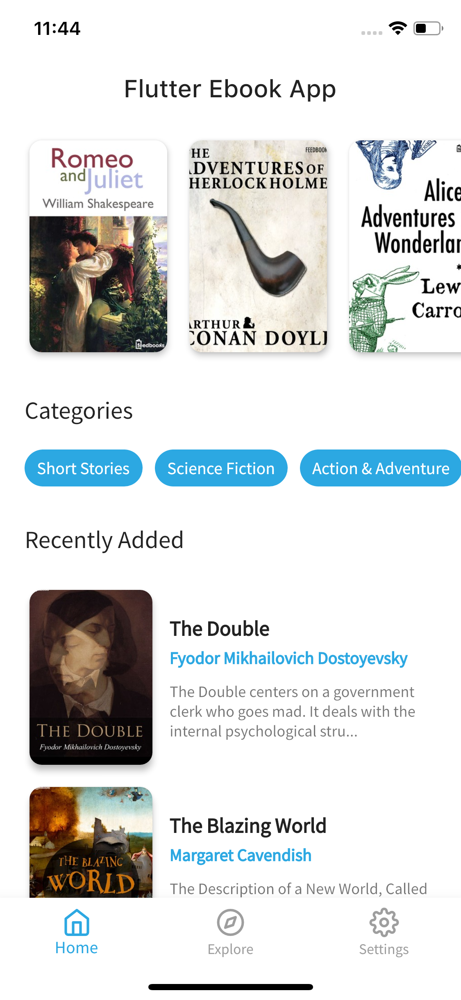
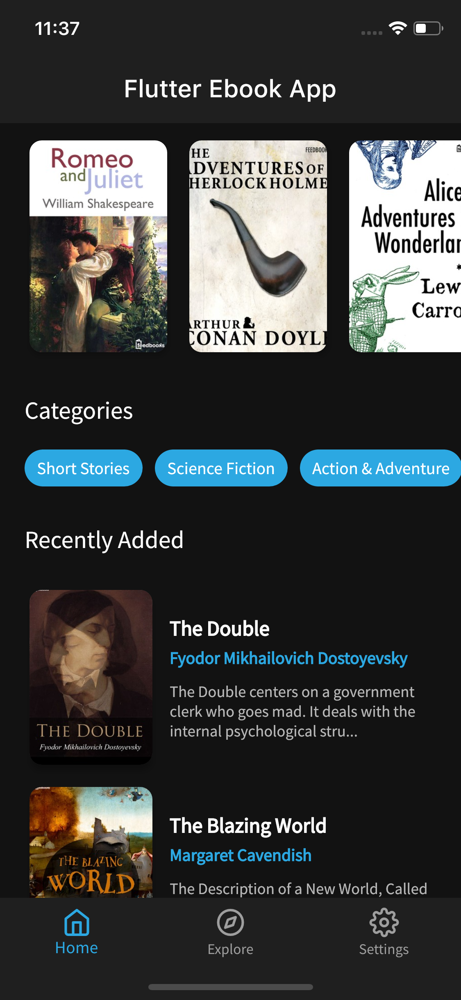
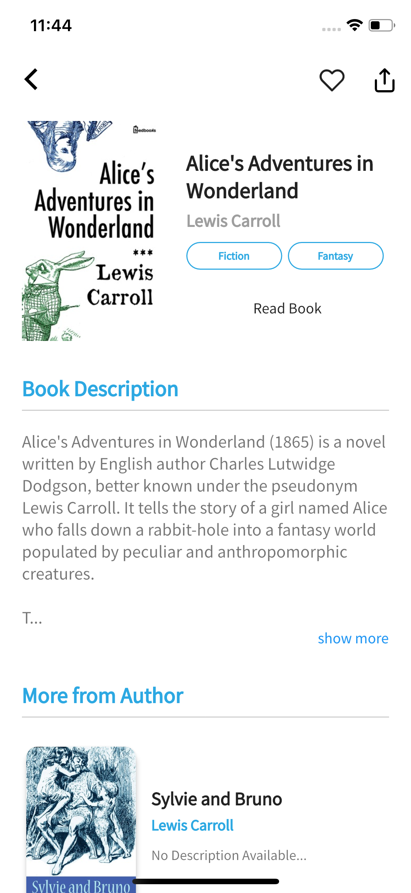
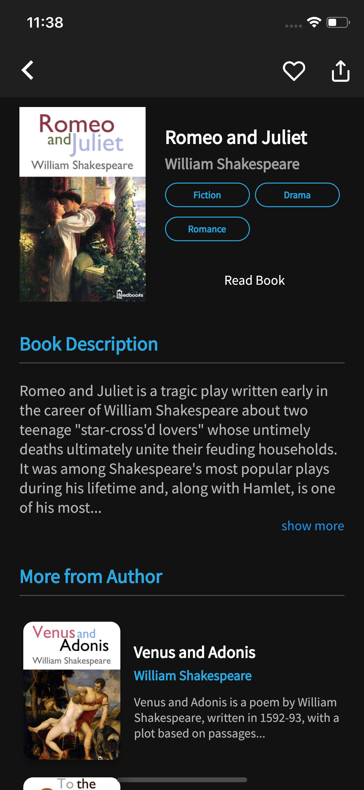
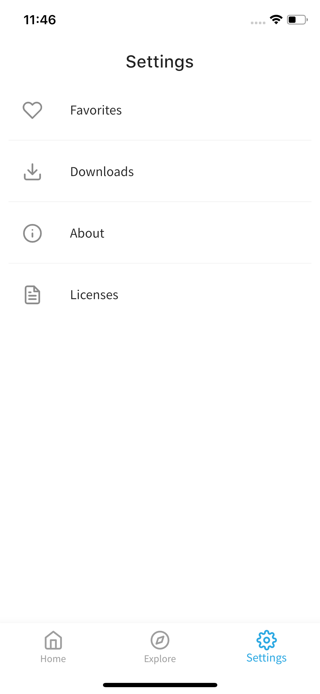

# 📖📖 Flutter eBook App

## ✨ Features

- [x] Download eBooks.
- [x] Read eBooks.
- [x] Favorites.
- [x] Dark Mode
- [x] Swipe to delete downloads.

## 📸 ScreenShots

<!--  -->

| Light                             | Dark                              |
| --------------------------------- | --------------------------------- |
|   |   |
|   |   |
|   |   |
|   |   |
|   |  |
|  |  |
|  |  |

## 🔌 Plugins

| Name                                                                   | Usage                                         |
| ---------------------------------------------------------------------- | --------------------------------------------- |
| [**Provider**](https://pub.dev/packages/provider)                      | State Management                              |
| [**Object DB**](https://pub.dev/packages/objectdb)                     | NoSQL database to store Favorites & Downloads |
| [**XML2JSON**](https://pub.dev/packages/xml2json)                      | Convert XML to JSON                           |
| [**DIO**](https://pub.dev/packages/dio)                                | Network calls and File Download               |
| [**Iridium Reader**](https://github.com/Mantano/iridium_reader_widget) | Plug and play reader widget for epubs         |
